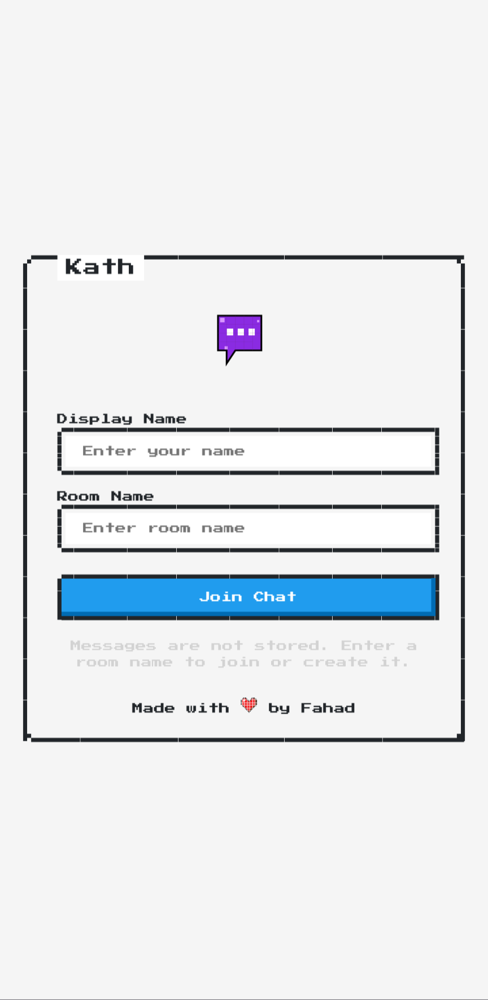
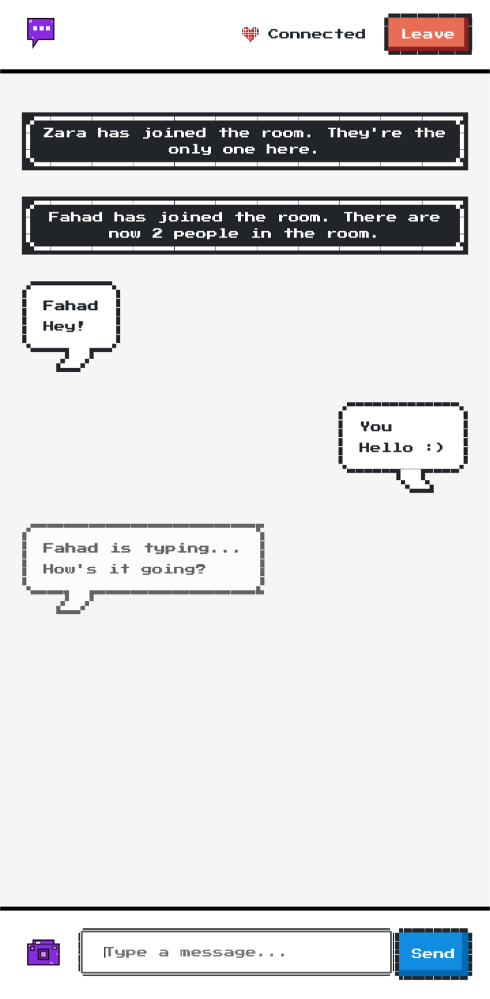

Kath
-------
Kath is a lightweight, retro-style, ephemeral chat app with a small twist: you can see what the other people in the room are typing in real-time.

| Landing Page                                  | Chat Screen                            |
| --------------------------------------------- | ----------------------------------- |
|  |  |

- **Demo:** [kath.fahads.net](https://kath.fahads.net/)

Quickstart (using docker)
-------
Clone this repo and run the docker-compose stack:

```bash
git clone git@github.com:sinandredemption/kath.git && cd kath
docker compose up --build # Or docker-compose up --build
```

By default, kath would run on http://localhost:5513. To host it at some other URL, modify `APP_URL` and `PORT` in `.env` file.

Development
-------
Kath is built using React and Node.js. To run Kath locally for development purposes, you'll need to set up both the client and server components.

## Prerequisites
*   **Node.js**
*   **npm**

## Steps

Clone this repo
```bash
git@github.com:sinandredemption/kath.git
```

### Server setup
Open a new terminal window. Navigate to `kath/` and run:
```bash
cd server
npm install
npm run dev
```
The server should now be running on port 3001. Do not close this terminal window to keep the backend server running.

### Client setup
Open a new terminal window. Navigate to `kath/` and run:
```bash
cd client
npm install
npm run dev
```
Kath should now be running on port 5173. Navigate to `http://localhost:5173/` in your browser to see it in action!

Credits
-------
This project utilizes the wonderful [NES.css](https://nostalgic-css.github.io/NES.css/) framework by [BcRikko](https://github.com/BcRikko) for its retro styling.
